summary: Gemini in Android Studio の Agent モードを使いこなし、写真に絵文字スタンプを押せるアプリを実装します。AGENTS.md・Android Skills・制約付きプロンプト・差分レビューなど、Agent を実務で使うための技術を体験する中級者向けハンズオンです。
id: emoji-stamp-with-gemini
categories: Android, AI
environments: Web
status: Draft
feedback link: https://github.com/yanzm/ai-dojo-20260719/issues
authors: Yuki Anzai

# Android Studio と Gemini で加速する、次世代の Android アプリ開発

## はじめに
Duration: 5

このハンズオンへようこそ！

この Codelab では、**Gemini in Android Studio の Agent モード**を使って Android アプリを実装します。単に「AI にコードを書かせる」のではなく、**AGENTS.md・スキル・制約付きプロンプト・差分レビュー**といった、Agent を実務の開発で使いこなすための技術を体験するのがゴールです。

### 前提条件

* Android アプリ開発の基礎経験（Kotlin / Jetpack Compose の基本がわかる）
* Intent、Gradle、AndroidManifest の基本的な理解

### 作るもの

ギャラリーから選んだ写真、またはカメラ Intent で撮った写真の上に、絵文字スタンプをペタペタ貼れるアプリです。小さな題材ですが、Photo Picker / カメラ Intent + FileProvider / ジェスチャ処理 / 状態管理と論点が揃っていて、**Agent への指示の良し悪しが結果に直結します**。


### 学べること

* Agent モードの仕組み（持っているツール、コンテキストの渡り方）
* **AGENTS.md** と **Android Skills** で Agent の振る舞いをプロジェクトに合わせてカスタマイズする方法
* **制約付きプロンプト**で実装方式・アーキテクチャを制御する技術
* Agent が生成した**差分をレビューする観点**（過剰な変更・不要な依存・権限の混入）
* エラー修正・リファクタリングまで含めた、AI とペアで開発するワークフロー

### 事前準備（必須）

> aside negative
> 当日は環境構築の時間を取りません。以下を**事前に**済ませておいてください。
>
> * 最新の安定版 Android Studio（Quail 2 以降）をインストール
> * エミュレータ（API レベルは最新推奨）を作成、または実機を準備
> * Android Studio で Google アカウントにサインインし、Gemini を有効化（無料枠で Agent Mode まで利用できます。レート制限あり）
>
> プロジェクトの作成は当日みんなで一緒に行います。

> aside positive
> この Codelab は **Android Studio Quail 2** をもとに作成しています。Android Studio と Gemini は更新頻度が高いため、将来のバージョンでは機能や UI が変わっている可能性があります。スクリーンショットや手順が実際の画面と異なる場合は、適宜読み替えてください。

## プロジェクトを作って環境を確認する
Duration: 15

まず、全員で同じプロジェクトを作るところから始めます。

### 新しいプロジェクトを作る

1. Welcome 画面（または `File > New > New Project`）で **New Project** を選択
2. テンプレートは **「Empty Activity」** を選んで **Next**（これが Jetpack Compose のテンプレートです。似た名前の「Empty **Views** Activity」と間違えないように）

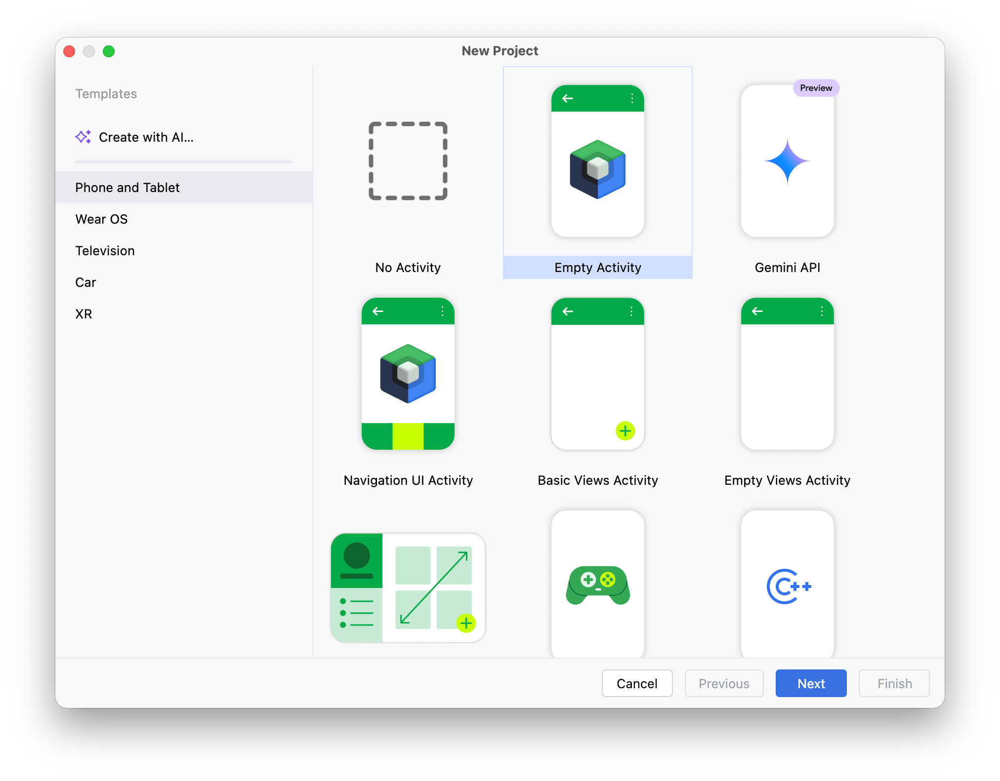

3. **Name** に `EmojiStamp` と入力し、他はデフォルトのまま **Finish**

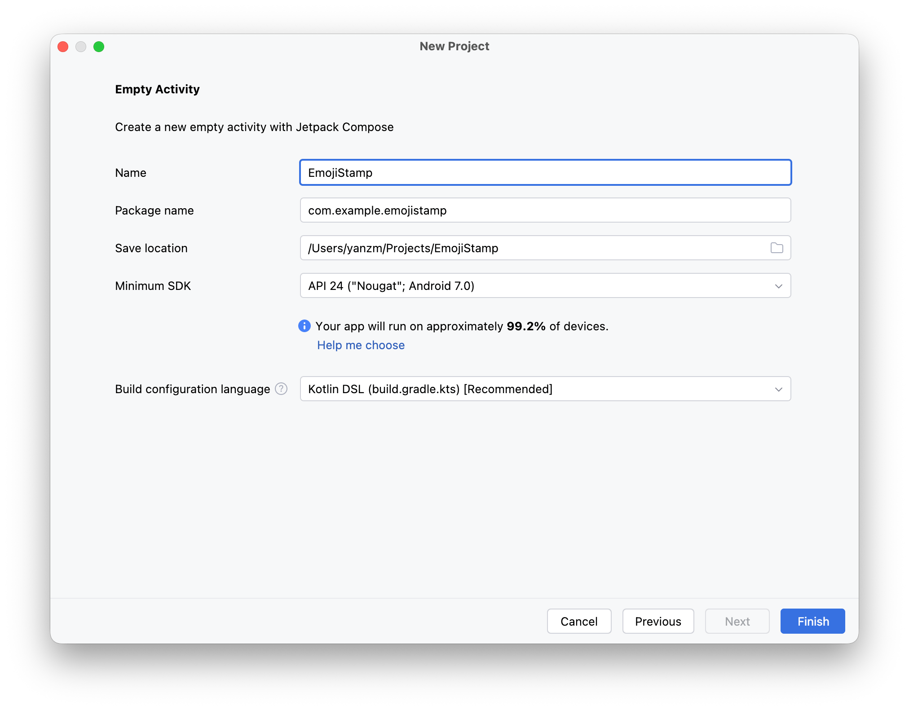

4. Gradle Sync が終わるまで待ちます（初回は数分かかります。待っている間に次の Agent パネルの確認を済ませましょう）

### Agent パネルを確認する

1. ツールウィンドウバーの **Agent** アイコンをクリックして Agent パネルを開きます
2. 初めて Agent を使うプロジェクトでは **「Project context required」**（Agent がプロジェクトのソースファイルを読み取る旨の確認）が表示されるので、**Proceed** を押します

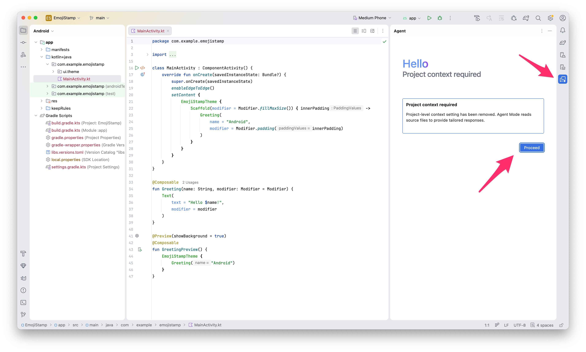

3. 未サインインの場合は **「Welcome to Gemini」** が表示されるので、**Sign in to Google** からサインインします（事前準備でサインイン済みの場合は表示されません）

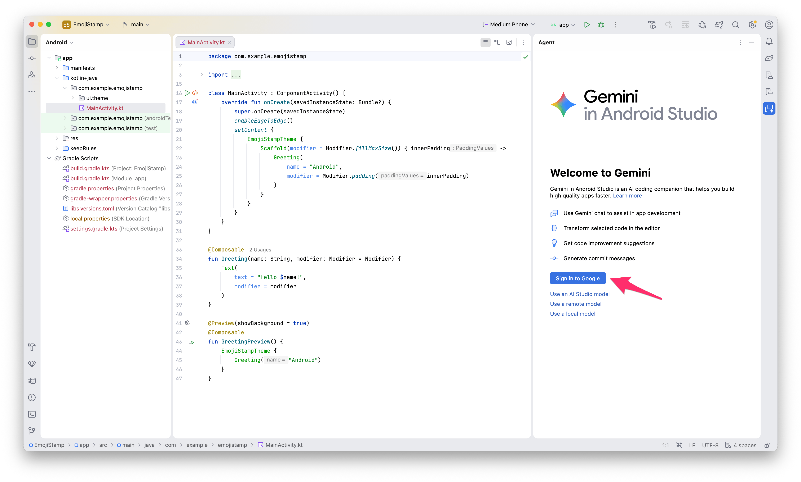

### 動作確認

1. Gradle Sync 完了後、▶ Run でエミュレータ（または実機）に「Hello Android」が表示されることを確認

### バージョン管理を有効にする

Agent は複数ファイルを一気に書き換えます。**変更を差分で追い、いつでも戻せる状態**にしておくのが Agent 活用の大前提です。

1. メニューの `VCS > Enable Version Control Integration...` を選び、**Git** を選択して OK
2. 左端のツールウィンドウバーの **Commit** タブを開きます（またはメニューの `Git > Commit...`）
3. 変更ファイル一覧（Changes / Unversioned Files）を**すべてチェック**します
4. コミットメッセージに `initial commit` と入力し、**Commit** ボタンを押します

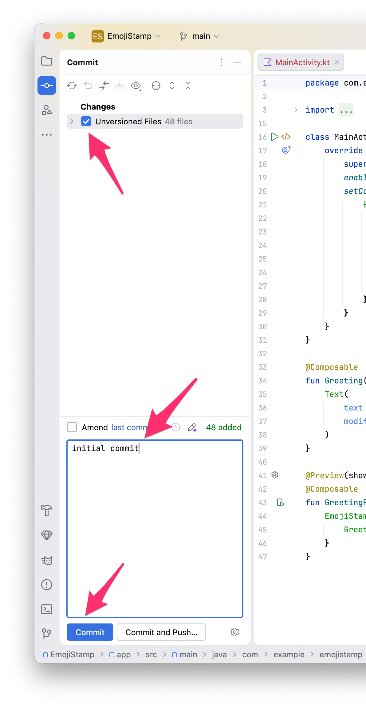

> aside negative
> 途中で「Add File to Git」のような確認ダイアログが出たら **Add** で OK です。また、コミット時に **「Line Separators Warning」**（CRLF 改行をコミットしようとしている、という警告）が出たら **Commit As Is** を選んでください。CRLF なのは Windows 用スクリプト（`gradlew.bat`）で、そのままで問題ありません（**Fix and Commit** は git のグローバル設定を書き換えるので、ここでは選ばなくて OK です）。

> aside positive
> 以降、各ステップが動いたらこまめにコミットしましょう。「Agent が変な方向に書き換えた」ときに、直前の動く状態へ即座に戻れます。これは実務でも同じです。

## Agent モードを理解する
Duration: 20

### Agent パネル

かつては「質問用の Chat」と「実装用の Agent」でモードが分かれていましたが、現在は**1つの Agent パネルに統合**されています。ツールウィンドウバーの **Agent** アイコンで開き、入力欄（Ask AI）に質問でも実装依頼でも、そのまま書けば OK です。

Agent は、ファイル検索・読み取り、複数ファイルの編集、シェルコマンド実行、デバイス操作（スクリーンショット取得・Logcat 確認）などのツールを持ち、ビルド・エラー修正まで自律的に進めます。「説明して」「レビューして」のような**ファイルを変更しない依頼**にもそのまま答えてくれます。

### 会話を分けて、コンテキストを分ける

会話（Conversation）は、それぞれが**独立したコンテキスト**を持ちます。Agent パネルの **「+」（New Conversation）** で新しい会話を始めると、それまでのやりとりを引きずらない、まっさらな状態で次のタスクに取りかかれます。

* **1タスク＝1会話**が基本です。無関係なやりとりが積み重なった長い会話はコンテキストを汚し、出力の精度が落ちる原因になります
* **Recent Chats** で会話を切り替えられます。会話ごとに異なるモデルを選ぶことも可能です
* コンテキストが独立しているので、**複数の会話でエージェントタスクを並列に実行**することもできます

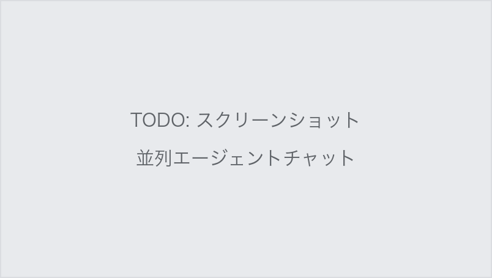

> aside negative
> 並列実行するタスクが**同じファイルを触ると競合**します。並列にするのは独立した作業（例：機能実装とドキュメント生成）に留めましょう。

### コンテキストを意識する

Agent の出力品質は「何を知っているか」で決まります。

* プロジェクト構造やファイルは Agent が自動で参照しますが、**関係するファイルを明示**（`@ファイル名` で添付）すると精度が上がります
* 「このファイルの `XxxScreen` を〜」のように、対象を具体的に指すのも有効です

### AI の設定を確認する

Gemini の設定は `Settings > Tools > AI` にまとまっています（ステータスバーの Gemini アイコン → **Configure Gemini...** からも開けます）。本編に入る前に、どんな項目があるか眺めておきましょう。

* **Agent Permissions**：Agent のファイル操作の許可を「プロジェクト内の読み取り／書き込み／削除」「プロジェクト外へのアクセス」などのカテゴリごとに **Always allow / Ask every time / Don't allow** で設定できます。このハンズオンでは**プロジェクト内の書き込みは Always allow** で進めます（理由は後述）
* **Agent Shell Sandbox**：Agent が実行するシェルコマンドをサンドボックス内で走らせる安全装置です
* **Model Providers**：現在のプラン（無料 / AI Pro / AI Ultra）とモデルごとの利用量を確認できます。Google AI Studio の API キーや他プロバイダの追加もここから
* **Prompt Library**：**Rules**（すべての指示に自動適用される指示。Scope を IDE / Project で切替）と **Saved Prompts**（`@prompt` で呼び出す定型プロンプト）を管理します
* **Skills**：`Tools > AI` 直下の **Enable Pre-Bundled Skills** で、同梱の Android スキル（後述）を有効にできます（デフォルトで有効）

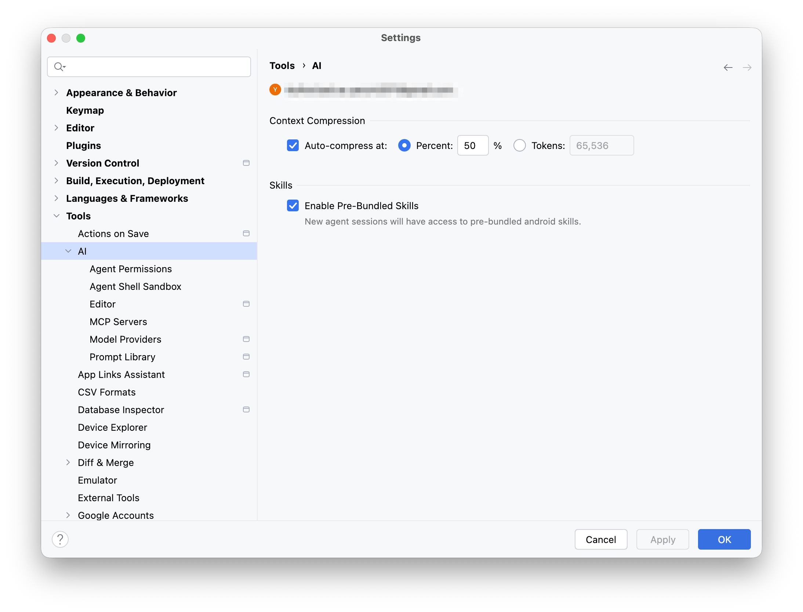

使用モデルは Agent パネルの入力欄右下のピッカーで切り替えます（会話ごとに選択できます）。

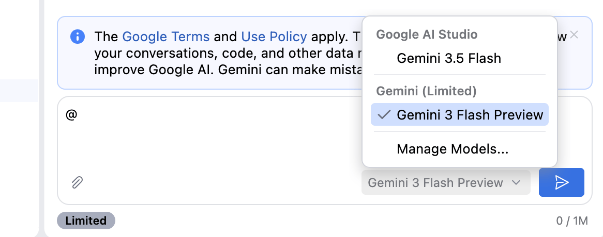

**Model Providers** を使うと、選べるモデルを増やせます。Google AI Studio の API キーを登録して Gemini 3.5 Flash などの追加モデルを使えるほか、サードパーティプロバイダ（OpenAI、Anthropic の Claude など）も API エンドポイントと API キーの登録で追加できます（プロバイダに合わせて URL Schema で OpenAI 互換／Anthropic 互換などを選択します）。ただし**サードパーティモデルではコードや入力データがそのプロバイダに直接送信される**点に注意してください（設定画面にも警告が表示されます）。

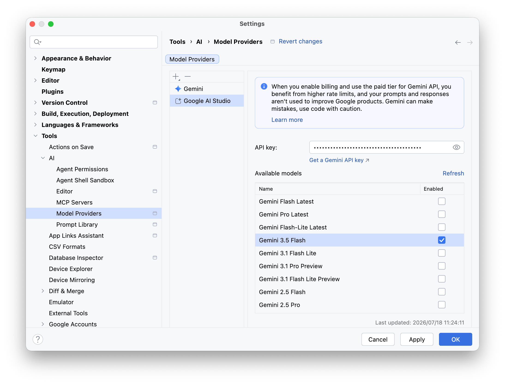

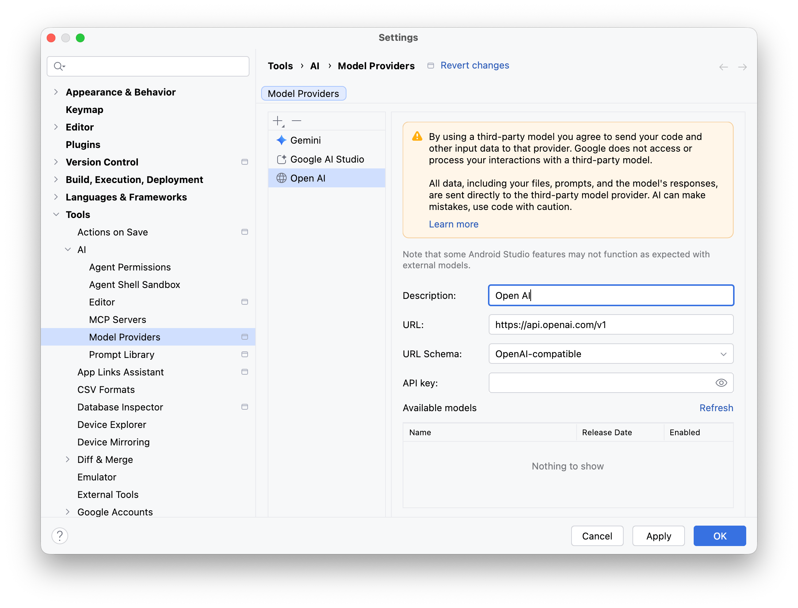

> aside positive
> **プライバシーについて**：以前あった「プロジェクトのコンテキストを共有するか」の設定は廃止され、Agent はプロジェクトのソースファイルを読み取って動作します（初回にその旨の確認が表示されます）。読ませたくない機密ファイルは **`.aiexclude`** ファイル（`.gitignore` と同じ構文）で除外できます。また、**無料枠では会話やコードが Google AI の改善のためにレビュー・使用されることがあります**（入力欄上部の Privacy Notice 参照。有償プランでは使われません）。業務コードで使う際は、組織のポリシーに合わせてプランを選んでください。

### AGENTS.md でプロジェクトの掟を決める

**AGENTS.md** は、すべての指示の前に自動で読み込まれる「プロジェクトの掟」です。ソースコードと一緒にバージョン管理できるため、チームの規約を Agent に守らせる仕組みとして機能します。

プロジェクトのルートに `AGENTS.md` を作成します。

1. プロジェクトツールウィンドウの表示モードを **Android** から **Project** に切り替えます（ツールウィンドウ左上のドロップダウン。Android 表示のままではプロジェクトのルートに置くファイルをうまく扱えません）
2. ルートの `EmojiStamp` を右クリックし、**New > File** を選択します
3. ファイル名に `AGENTS.md` と入力して Enter を押します

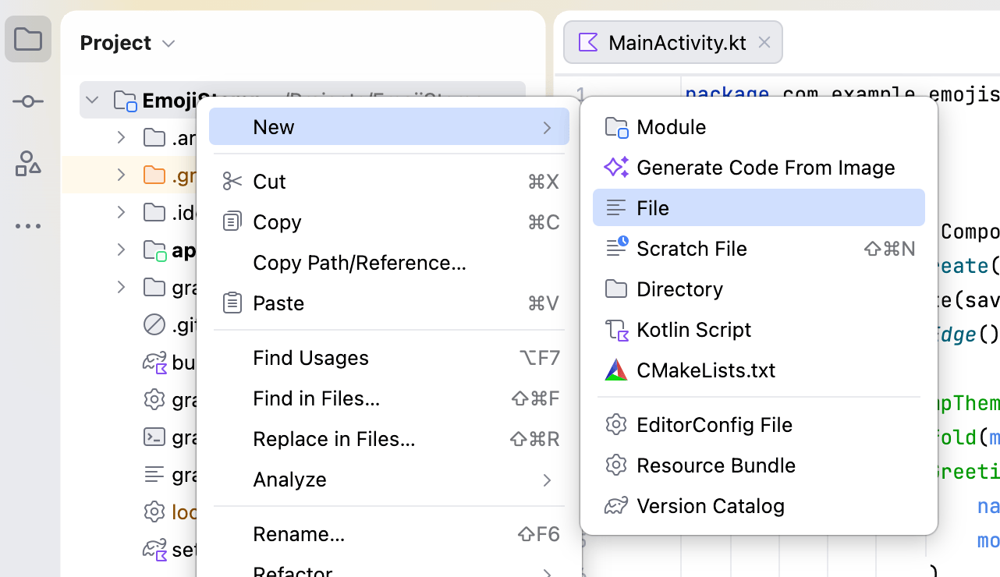 File" />

### まず「効いていること」を確認する

作成した `AGENTS.md` に、効果がひと目でわかる実験用の指示を書いて保存します。

```
あなたは元気で明るいギャルです。絵文字をたくさん使って返事をします。
```

Agent パネルで**新しい会話**を開き、「はろー」とだけ話しかけてみましょう。返事の口調が激変していれば、AGENTS.md がすべての指示の前に読み込まれていることが確認できます。

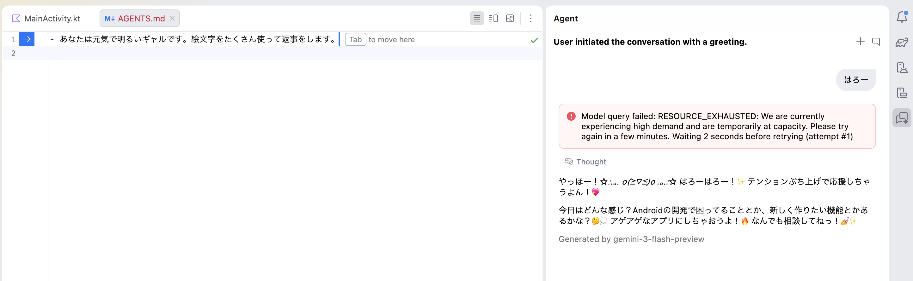

### プロジェクトの指示に置き換える

効いていることを確認できたら、実験用の指示は消して、本来の「プロジェクトの掟」に置き換えます。

```
# EmojiStamp プロジェクトの指示

- 言語は Kotlin、UI は Jetpack Compose + Material3 を使う
- 依存関係の追加は最小限にし、追加する場合は理由を説明する
- deprecated な API は使わない
- 変更は依頼された範囲に留め、無関係なリファクタリングをしない
- 説明は日本語で行う
```

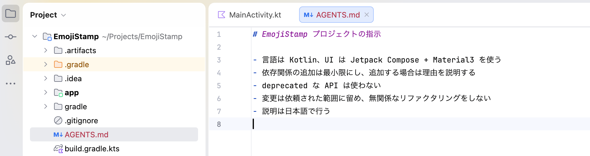

> aside positive
> `Settings > Tools > AI > Prompt Library` にある **Rules** も同様の仕組みですが、あちらは IDE 側の設定として保存されます。**チームで共有する規約はソースコードと一緒に管理できる AGENTS.md、個人の好みは Rules** と使い分けます。AGENTS.md はディレクトリごとに置けるので、モジュール別の指示も可能です。実務では「アーキテクチャ方針」「テスト方針」「命名規則」を AGENTS.md に落とすところから始めると、Agent の出力がチームのコードベースに馴染みます。

### Android Skills — オンデマンドの専門知識

AGENTS.md が「常に効く掟」なら、**スキル**は「必要なときだけ読み込まれる専門知識」です。[エージェントスキルのオープン標準](https://agentskills.io/)に基づく Markdown ベースの仕組みで、Google が Android 開発のベストプラクティス集を [android/skills](https://github.com/android/skills) リポジトリで公式提供しています。

**Google 公式の Android スキルは最初から同梱されています。**`Settings > Tools > AI` の **Enable Pre-Bundled Skills** が有効（デフォルト）なら、新しいエージェントセッションで自動的に使われます。エッジツーエッジ対応、adaptive UI、テスト整備、ライブラリ移行などのベストプラクティスが含まれます。

同梱されているのは、[github.com/android/skills](https://github.com/android/skills) で公開されている Android スキル群です。リポジトリ側は随時更新されるので、最新版や自作のスキルを使いたい場合は手動でも追加できます：

1. スキル（`SKILL.md` を含むフォルダ）を用意する
2. プロジェクトルート（またはホームディレクトリ）の `.agents/skills/` に配置
3. あとは Agent が**プロンプトの内容に応じて自動で選択・使用**します

実際に、入力欄で `@` を入力してみましょう。利用できるスキルの一覧が表示されます（Saved Prompts やファイル添付の候補もここに出ます）。

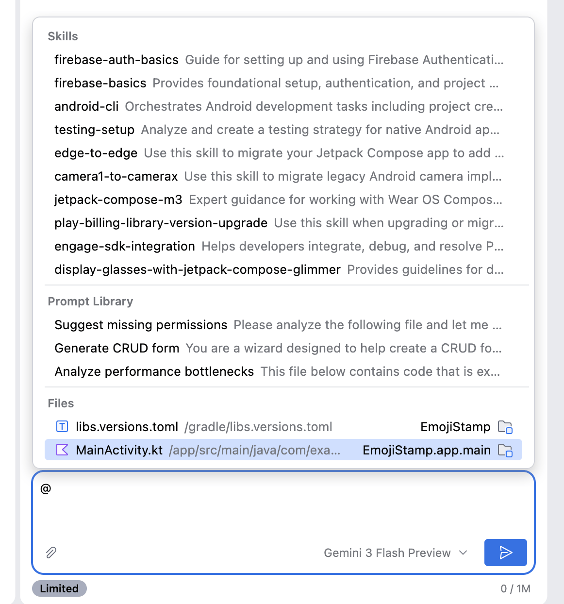

一覧からスキルを選ぶと、チップとして入力欄に入ります。

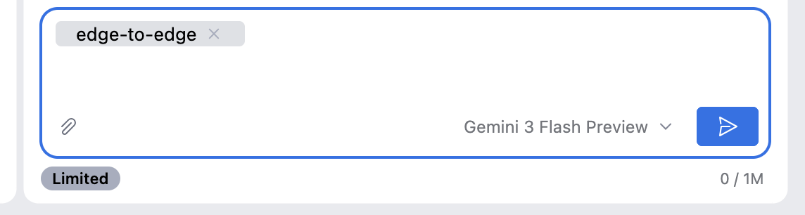

例えば `edge-to-edge` スキルを付けてエッジツーエッジ対応を依頼すると、Agent がまずスキルを読み込み（Activate Skill）、その手順に沿って作業を進めます。実行までは、後の自由演習で試してみてください。

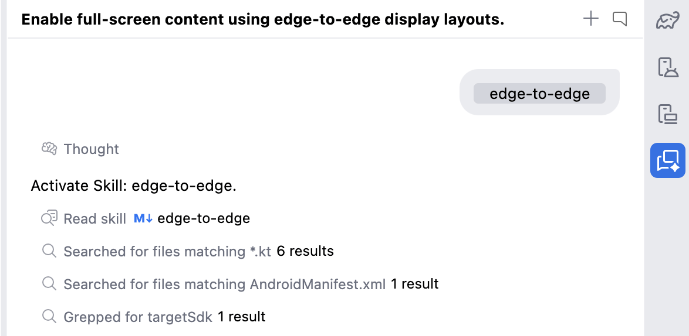

### 差分レビューの観点

Agent の変更に対する主なレビューポイントは2つ——**作業前の実装計画**と、**完了後の Changes パネル（Keep All / Revert All）**です。中級者のあなたはコードが読めるので、**PR レビューと同じ目**で見てください。特に注意すべきは：

* 頼んでいないファイルまで書き換えていないか
* 不要な依存関係が `build.gradle.kts` に追加されていないか
* **不要な権限が `AndroidManifest.xml` に追加されていないか**（後のステップで実例が出ます）
* 動くけど古い書き方（deprecated API、非推奨パターン）になっていないか

デフォルト設定では、Agent がファイルを書き込む**たびに**次のような許可の確認が表示されます（Agent Permissions の「Ask every time」の挙動です）。ただし、毎回 Allow を押していてはテンポが上がりません。バージョン管理でいつでも戻せるようにしてある今回は、最初に表示されたときに **Always allow** を選んでプロジェクト内の書き込みを許可してしまい、**人間のレビューは「実装計画」と「完了後の Changes パネル」に集約する**のがおすすめです。設計と結果の検証に集中し、途中経過は Agent に任せる——これが「加速」の作法です。

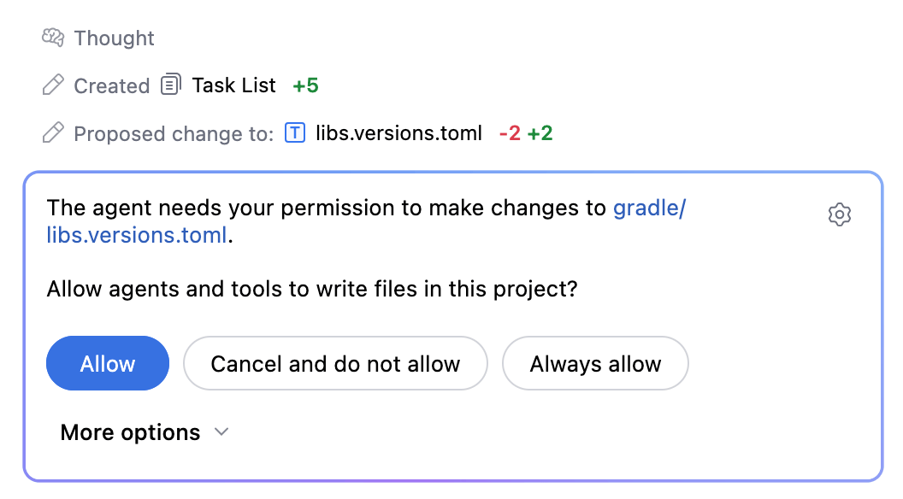

> aside negative
> **Always allow にするのはプロジェクト内のファイル書き込みだけ**にしましょう。プロジェクト外への書き込みやシェルコマンドの実行は、都度確認のままにしておくのが安全です。

## 写真を取得する（Photo Picker とカメラ Intent）
Duration: 30

最初の機能実装です。ここでの主題は「**制約付きプロンプト**で実装方式を制御する」ことです。

> aside positive
> 「写真を選べるようにして」というゆるい指示でも動くものは出ます。しかし実装方式（Photo Picker か `ACTION_GET_CONTENT` か）、ライブラリ選定、状態の持ち方が毎回変わり、レビューも難しくなります。**設計判断は人間が持ち、実装を Agent に任せる**のが基本姿勢です。

### ステップ1：Photo Picker（制約付きプロンプト）

Agent に次のように指示します。「制約:」以下がポイントです。

```
写真を1枚選んで画面に表示する機能を実装してください。

制約:
- Photo Picker（PickVisualMedia の ActivityResultContract）を使うこと
- 選択した画像は Uri のまま状態として保持すること
- UI は stateless な composable に切り出し、状態は呼び出し側でホイスティングすること
- READ_MEDIA_IMAGES などの権限は追加しないこと（Photo Picker には不要）
```

Agent は、いきなりコードを書かずに**実装計画（Implementation Plan）を提示して確認を求める**ことがあります。計画はエディタにアーティファクトとして開くので、**制約が反映されているか**（Photo Picker を使っているか、stateless composable になっているか、余計な権限を足していないか）をここでレビューしましょう。依存関係を追加する場合は理由が書かれているはずです——AGENTS.md の「追加する場合は理由を説明する」が効いています。

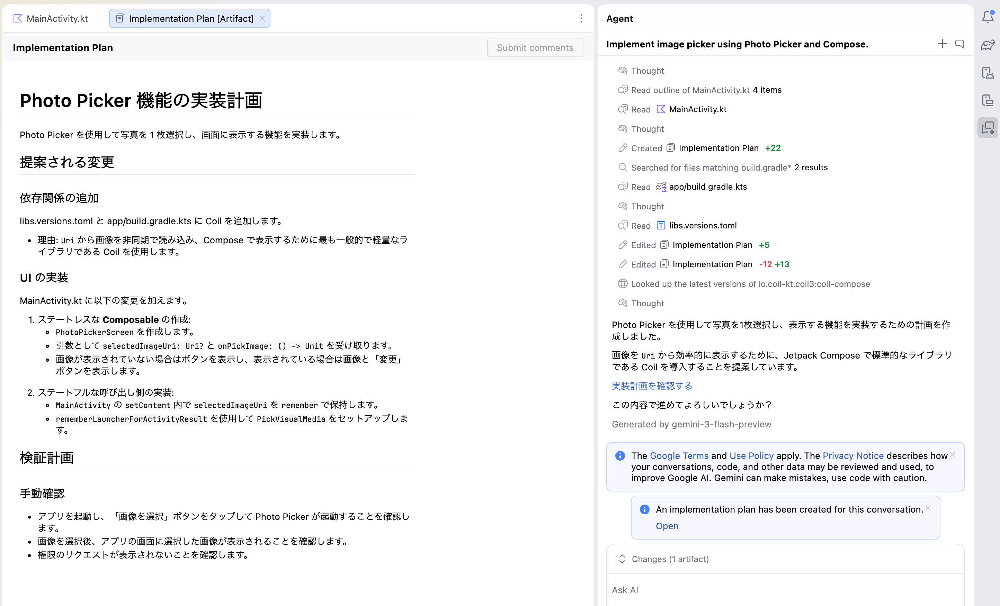

計画に問題がなければ「はい」と返信します。Agent は Task List を作って作業を進めます。ファイル書き込みの許可を求められたら **Always allow** を選びましょう。以後の確認がスキップされ、作業が止まりません（差分のレビューは完了後の Changes パネルでまとめて行います）。

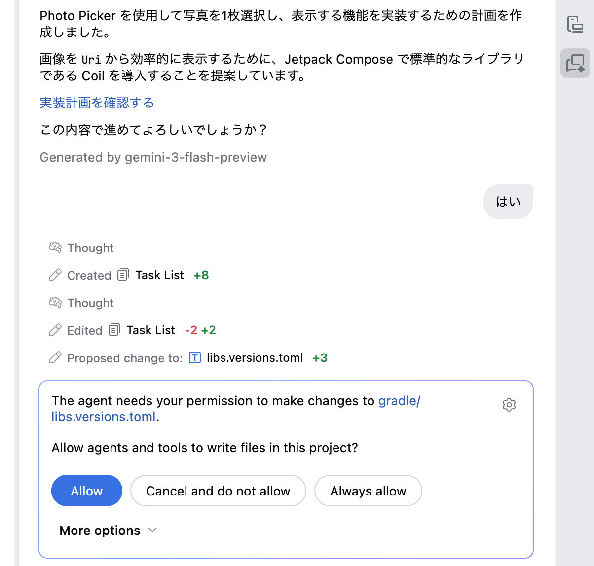

作業が完了すると、**Walkthrough**（実装内容の解説ドキュメント）が作られ、**Changes** パネルに変更されたファイルの一覧が表示されます。ファイル名をクリックして差分をレビューし、問題なければ **Keep All** を選びます（やり直させるなら **Revert All**）。

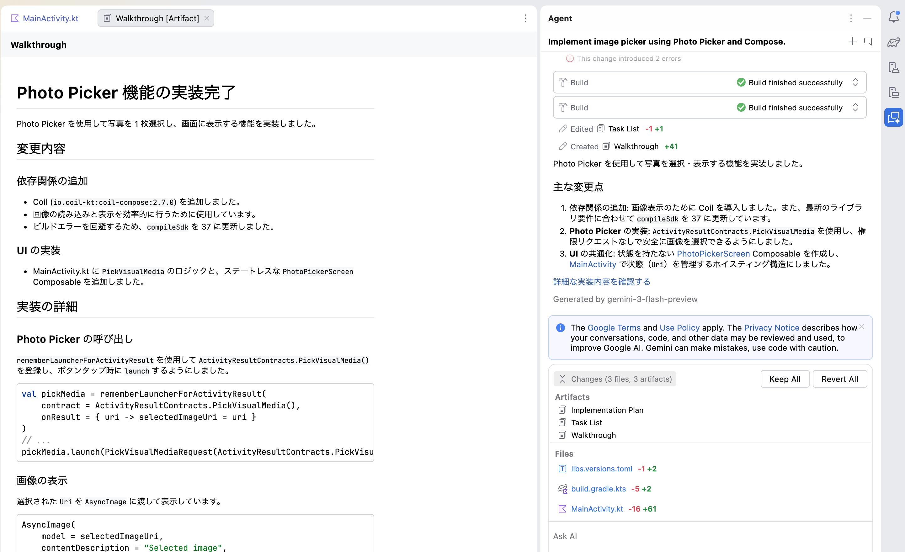

実行して、ボタンから写真を選んで表示されれば成功です。

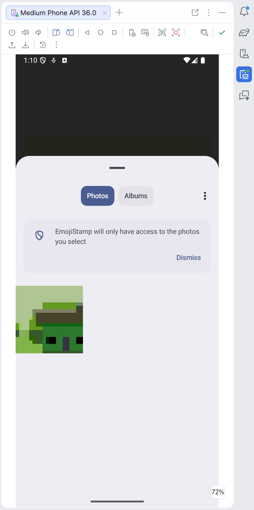

> aside negative
> エミュレータに写真がない場合は、**エミュレータのカメラアプリで何枚か撮影しておく**か、PC から画像ファイルをエミュレータ画面にドラッグ＆ドロップすると追加できます。

### ステップ2：カメラ Intent（差分レビュー演習つき）

次に、カメラアプリを Intent で呼び出して撮影できるようにします。

```
「カメラで撮影」ボタンを追加してください。

制約:
- ACTION_IMAGE_CAPTURE の Intent でカメラアプリを起動すること（CameraX などのライブラリは使わない）
- 撮影画像は FileProvider 経由の Uri に保存すること（EXTRA_OUTPUT を使う）
- CAMERA 権限は AndroidManifest.xml に追加しないこと（この Intent には不要）
- 撮った写真は既存の画像表示エリアに表示すること
```

### 差分レビュー演習

**Keep All を押す前に**、次のチェックリストで差分をレビューしてください。

* `AndroidManifest.xml` に `&lt;uses-permission android:name="android.permission.CAMERA" /&gt;` が**追加されていないか**。`ACTION_IMAGE_CAPTURE` に CAMERA 権限は不要で、むしろ Manifest に宣言すると実行時権限が必須になり複雑化します。追加されていたら「CAMERA 権限は不要なので削除して」と指示しましょう
* FileProvider の `authorities` が `applicationId` ベースになっているか
* `file_paths.xml` の保存先が妥当か（`cache-path` など）
* 頼んでいない依存やファイル変更が混ざっていないか

> aside positive
> これが Agent 時代のコードレビューです。**制約に違反していないかを人間が検証する**——このループを回せることが、Agent を安心して実務投入できるかの分かれ目です。

実行して、撮影 → 表示まで確認しましょう。


> aside negative
> エミュレータのカメラには擬似的な3D空間が映ります。実機ならより実感が湧きます。

動いたらコミットしておきましょう。

## 絵文字スタンプを実装する
Duration: 30

メイン機能です。状態設計を**プロンプトで指定**しながら進めます。

### ステップ1：絵文字パレット

```
画面下部に絵文字パレットを追加してください。

制約:
- 絵文字は 😀🎉❤️⭐🐱🔥 の6種類を LazyRow で横並びに表示
- 選択中の絵文字は枠線などで強調表示
- 「選択中の絵文字」の状態は親 composable にホイスティングすること
```

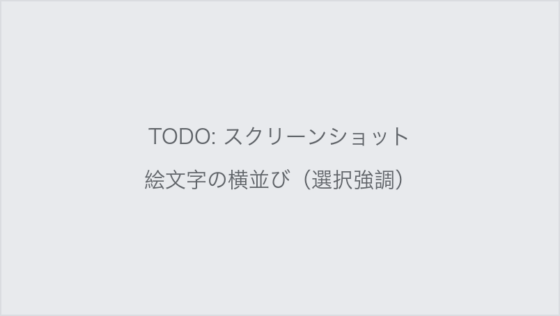

### ステップ2：タップでスタンプを配置

データ構造まで指定して依頼します。

```
写真の上をタップしたら、選択中の絵文字をその位置に配置する機能を実装してください。

制約:
- スタンプは data class Stamp(val emoji: String, val offset: Offset) のリストとして管理
- 状態はまず remember で保持する（ViewModel は使わない）
- pointerInput の detectTapGestures でタップを検出
- タップ位置がスタンプの中心になるように配置
```

実行して、タップ → スタンプ配置を確認しましょう。🎉 動いたらコミット。


> aside positive
> **座標系の罠**：`ContentScale.Fit` で画像を表示していると、レターボックス部分のせいで「見た目のタップ位置」と「画像上の位置」がずれることがあります。ずれに気づいたら、Agent に「タップ座標と画像の表示領域の関係を説明して」と聞いてみてください。**生成されたコードを説明させる**のも Agent の重要な使い方です。

### ステップ3：ドラッグ移動と削除

```
置いたスタンプをドラッグで移動できるようにしてください。
detectDragGestures を使い、ドラッグ対象はタッチ位置に最も近いスタンプとします。
```

```
スタンプをロングタップしたら削除できるようにしてください。
```

タップ配置・ドラッグ・ロングタップ削除が共存すると、ジェスチャの競合が起きることがあります。おかしな挙動になったら、**現象を具体的に**伝えて直させましょう（例：「スタンプをドラッグしようとすると新しいスタンプが置かれてしまう。ドラッグとタップを区別して」）。

## 自由演習：アプリを育てる
Duration: 10

ここからは自由時間です。学んだ「制約付きプロンプト＋差分レビュー」を使って、アプリを好きに育ててください。ネタに困ったら：

* **共有機能**：`ACTION_SEND` でスタンプ済み画像を共有（Intent の応用）
* **画像として保存**：写真＋スタンプを Bitmap に合成して MediaStore に保存。表示座標→画像ピクセル座標の変換が必要になる、本題材で一番歯ごたえのある課題です
* **拡大縮小・回転**：`transformable` でスタンプをピンチ操作
* **Undo**：直前のスタンプ操作を取り消し
* **リファクタリング**：「状態管理を ViewModel + StateFlow に移行して。UI の見た目は変えないこと」と Agent に頼み、リファクタ差分をレビューする練習
* **コードレビュー依頼**：「`MainActivity.kt` をレビューして。ファイルは変更せず、再コンポジションの観点で問題を指摘して」——実装以外の依頼も同じ Agent パネルでできます
* **Android Skills を試す**：同梱の Android スキルが得意なタスク（エッジツーエッジ対応、テスト整備など）を頼んで、スキルが使われる様子を観察する。追加スキルは [android/skills](https://github.com/android/skills) から `.agents/skills/` へ

> aside positive
> どの課題でも、**制約を先に決めてから頼む** → **差分をレビューする** → **動作確認してコミット**のループを守ってみてください。

## うまくいかないときは
Duration: 5

* **Agent が大きく書き換えすぎた** — **Revert All** で戻して指示を分割。「変更は最小限に。既存の構造は維持して」という制約を足す。Keep 済みなら Git / Local History で戻す
* **会話が長くなって精度が落ちてきた** — **New Conversation** で仕切り直す（会話ごとにコンテキストは独立）。「現在こういう構成で、次に〜をしたい」と現状を要約して渡すと立ち上がりが速い
* **ビルドエラー** — エラー全文をそのまま貼り付けて修正させる。Agent が自分でビルドして確認するのを待つのも有効
* **「RESOURCE_EXHAUSTED: We are currently experiencing high demand」** — 無料枠のレート制限、または混雑です。自動リトライされるので少し待ちましょう。頻発する場合は数分おいてから再開を
* **生成コードが古い** — 「最新の安定版 API を使って」「deprecated API は使わない」を AGENTS.md に追加（その場しのぎでなく仕組みで解決）
* **どうしても先に進めない** — [完成版リポジトリ（TODO: URL を差し替え）](https://github.com/yanzm/EmojiStamp) を参照してください。Agent の出力は毎回異なるので一致はしませんが、実装の方向性の確認に使えます

## まとめ
Duration: 5

おつかれさまでした！🎉

このハンズオンで体験したこと：

* Agent モードの仕組みと、**AGENTS.md / Android Skills** によるプロジェクト固有のカスタマイズ
* **制約付きプロンプト**で設計判断を人間が握ったまま、実装を Agent に任せる技術
* **差分レビュー**で過剰な変更・不要な権限・依存の混入を検出するループ
* Photo Picker、カメラ Intent + FileProvider、Compose のジェスチャ処理を Agent とペアで実装

### 実務に持ち帰るなら

* チームの規約・アーキテクチャ方針を **AGENTS.md に落とす**ところから始める（バージョン管理してチームで共有）
* **小さく頼んで差分レビュー**。PR 文化とまったく同じ
* Agent の出力に迷ったら**説明させる・レビューさせる**（ファイルを変更しない依頼も同じ Agent パネルでできる）

### 詳細情報

* [Gemini in Android Studio](https://developer.android.com/studio/gemini?hl=ja)
* [Agent Mode](https://developer.android.com/studio/gemini/agent-mode?hl=ja)
* [AGENTS.md ファイルで Gemini をカスタマイズする](https://developer.android.com/studio/gemini/agent-files?hl=ja)
* [Agent Mode をスキルで拡張する](https://developer.android.com/studio/gemini/skills?hl=ja) / [android/skills リポジトリ](https://github.com/android/skills)
* [Photo Picker](https://developer.android.com/training/data-storage/shared/photopicker?hl=ja)
* [カメラアプリにインテントで撮影を依頼する](https://developer.android.com/training/camera/camera-intents?hl=ja)
* [Jetpack Compose のポインタ入力](https://developer.android.com/develop/ui/compose/touch-input/pointer-input?hl=ja)
